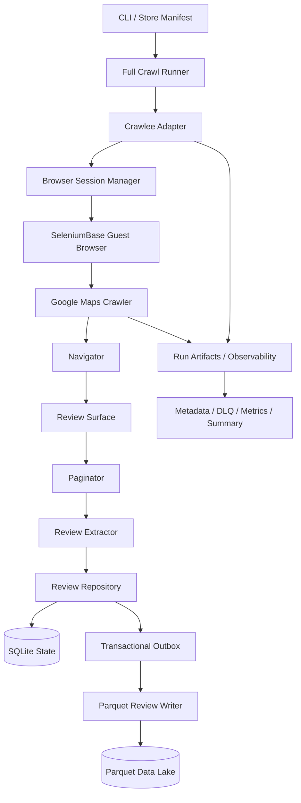

# Retail Review Integration Data Platform

A data engineering platform for collecting, normalizing, and persisting store reviews from Google Maps for downstream analytics and recommendation use cases.

The platform separates crawl orchestration, browser lifecycle, source-specific extraction, durable crawler state, and analytical storage into independent components.

SeleniumBase provides browser automation, Crawlee handles crawl orchestration and retry flow, SQLite stores durable crawler state and idempotency metadata, and Parquet stores normalized review change events for analytics.

The crawler operates only through valid guest-access flows. It does not solve CAPTCHAs, automate sign-in, inject authentication cookies, or rotate proxies.

## Architecture Overview



The main architectural boundaries are:

- `browser/` — browser creation and session lifecycle
- `orchestration/` — request scheduling, retries, and crawl coordination
- `sources/google_maps/` — Google Maps-specific navigation, review access, pagination, and extraction
- `storage/` — durable state, idempotency, transactional outbox, and Parquet persistence
- `observability/` — run metadata, timing, DLQ, metrics, and summaries
- `runners/` — application-level dependency wiring and crawl lifecycle
- `scripts/` — thin user-facing entrypoints

See [ARCHITECTURE.md](ARCHITECTURE.md) for the full design.

## Data Flow

A store crawl follows this flow:

```text
Store input
    ↓
Google Maps search
    ↓
Resolve exact place candidate
    ↓
Confirm /maps/place/... entity
    ↓
Open Reviews
    ↓
Classify review access
    ↓
Sort by Newest
    ↓
Paginate review cards
    ↓
Extract normalized Review objects
    ↓
ReviewRepository
    ↓
SQLite state + transactional outbox
    ↓
Parquet INSERT / UPDATE events
```

The crawler distinguishes between a Google Maps search preview and a confirmed place entity.

A `/maps/search/...` result is not considered sufficient. Review extraction begins only after the intended `/maps/place/...` entity has been resolved and confirmed.

## Persistence Model

The storage layer deliberately separates operational crawler state from analytical review payloads.

### SQLite — Durable State

SQLite is the source of truth for review identity and crawler state.

Default location:

```text
data/state/crawler_state.sqlite3
```

It stores information such as:

- source
- source review ID
- store ID
- content hash
- first seen timestamp
- last seen timestamp
- first seen run ID
- last seen run ID
- checkpoint metadata
- pending review events

The main review identity is:

```text
(source, source_review_id)
```

This allows review identity to remain stable across multiple crawl runs.

### Parquet — Analytical Payload

Normalized review payloads are stored as append-only change events:

```text
data/lake/google_maps_reviews/
└── crawl_date=YYYY-MM-DD/
    └── run_id=<run_id>/
        └── part-*.parquet
```

Each persisted event includes fields such as:

```text
run_id
source
source_review_id
store_id
reviewer_name
rating
review_text
review_date_raw
owner_response
observed_at
content_hash
change_type
```

Supported change types:

```text
INSERT
UPDATE
```

`UNCHANGED` reviews update durable state but do not create another Parquet event.

## Idempotency and Change Detection

Each review is identified by its stable source review ID.

A deterministic SHA-256 content hash is calculated from mutable review content.

The current behavior is:

```text
New review ID
→ INSERT state
→ INSERT Parquet event

Known review ID + same content hash
→ update last_seen
→ UNCHANGED
→ no Parquet event

Known review ID + changed content hash
→ update state
→ UPDATE Parquet event
```

This separates two concerns:

- **Idempotency** prevents duplicate ingestion.
- **Change detection** records meaningful review updates.

## Crash-Safe Outbox

SQLite and Parquet cannot participate in the same database transaction directly.

To avoid losing events between the two systems, the repository uses a transactional outbox.

```text
Review state update
        +
pending_review_events insert
        ↓
same SQLite transaction
        ↓
Parquet batch write
        ↓
temporary file
        ↓
atomic rename
        ↓
outbox acknowledgement
```

If the process crashes before Parquet finalization, the pending event remains in SQLite and is replayed on startup.

If the process crashes after Parquet rename but before outbox acknowledgement, the writer verifies the existing file against stored event IDs before acknowledging the event.

This prevents duplicate Parquet emission during recovery.

## Browser and Crawl Lifecycle

The browser lifecycle is independent from individual store crawls.

With the current default:

```text
concurrency = 1
```

a healthy browser can be reused across multiple stores.

Conceptually:

```text
Create browser
    ↓
Warm up once
    ↓
Store A
    ↓
Store B
    ↓
Store C
```

If the browser becomes unhealthy, invalid, or encounters a terminal access condition, the session manager can retire it and create a replacement.

Browser warm-up is owned by the browser/session lifecycle rather than repeated for every store.

## Crawl Statuses

Important terminal statuses include:

| Status | Meaning |
|---|---|
| `COMPLETE` | Natural end of the review list |
| `NO_REVIEWS` | Confirmed place has no reviews |
| `PARTIAL_TIMEOUT` | Crawl deadline reached while progress was still being made |
| `PARTIAL_LIMIT` | Configured safety or validation limit reached |
| `PAGINATION_STALLED` | Unexpected lack of pagination progress |
| `LIMITED` | Guest review access is limited |
| `AUTH_REQUIRED` | Full review access requires authentication |
| `SORT_FAILED` | Requested review ordering could not be confirmed |
| `PLACE_RESOLUTION_FAILED` | Intended Google Maps place could not be confirmed |

`PARTIAL_LIMIT` is treated as a non-error result and is not sent to the DLQ.

Other terminal failures may be recorded in the DLQ according to the failure taxonomy.

## Installation

Requirements:

- Python 3.11+
- Google Chrome or Chromium
- An environment capable of launching a browser

Create a virtual environment and install dependencies:

```bash
python -m venv .venv
python -m pip install -r requirements.txt
```

Main direct dependencies include:

```text
crawlee>=1.10,<2
seleniumbase>=4,<5
pyarrow>=17
```

## Standard Crawler Execution

Run the default crawler:

```bash
python -m crawl_experiment
```

Equivalent explicit configuration:

```bash
python -m crawl_experiment \
  --manifest config/known_coles_stores.json \
  --database data/state/crawler_state.sqlite3 \
  --parquet-root data/lake/google_maps_reviews \
  --checkpoints data/checkpoints \
  --concurrency 1
```

Available arguments:

| Argument | Default | Description |
|---|---|---|
| `--manifest` | `config/known_coles_stores.json` | Input store manifest |
| `--database` | `data/state/crawler_state.sqlite3` | Durable state and idempotency database |
| `--parquet-root` | `data/lake/google_maps_reviews` | Parquet review dataset |
| `--checkpoints` | `data/checkpoints` | Per-store JSON checkpoints |
| `--concurrency` | `1` | Number of concurrent requests |
| `--headed` | disabled | Display the browser window |

A minimal manifest:

```json
{
  "stores": [
    {
      "retailer_store_id": "710",
      "store_name": "Coles World Square",
      "address": "650 George St, Sydney NSW 2000, Australia"
    }
  ]
}
```

`store_name` is used to identify the expected Google Maps candidate.

When available, `address` provides additional evidence for rejecting same-name candidates at the wrong location and confirming the intended place entity.

## Observable Full-Crawl Runner

A dedicated runner is available for controlled multi-store crawls with detailed observability.

Example:

```bash
python scripts/coles_small_set_full_crawl.py \
  --store-id coles-berowra \
  --validation-mode \
  --max-scrolls 50 \
  --timeout-seconds 600
```

Useful options include:

```text
--store-limit
--store-id
--timeout-seconds
--max-scrolls
--validation-mode
```

Each run creates a timestamped directory under:

```text
data/full_crawl/coles_small_set/<run-id>/
```

Typical run artifacts include:

| Artifact | Purpose |
|---|---|
| `checkpoints/` | Latest crawl state for each store |
| `metadata/` | Per-store navigation and result metadata |
| `progress.log` | Crawl and browser lifecycle logs |
| `scroll_metrics.jsonl` | Per-scroll timing and pagination metrics |
| `review_id_trace.jsonl` | Review IDs observed during pagination |
| `dlq.jsonl` | Terminal unsuccessful crawl outcomes |
| `run_metadata.json` | Run-level configuration and lifecycle information |
| `summary.json` | Final run summary |

Durable review state remains in:

```text
data/state/crawler_state.sqlite3
```

while review change payloads are written to:

```text
data/lake/google_maps_reviews/
```

Reviews are persisted immediately after successful extraction, so already collected data remains available even if a crawl stops before completion.

Current JSON checkpoints are intended for observability and progress tracking. They do not yet restore the browser to a previously reached scroll position.

## Querying Parquet with DuckDB

The generated Parquet dataset can be queried directly using DuckDB.

Example:

```sql
SELECT *
FROM read_parquet(
    'data/lake/google_maps_reviews/**/*.parquet',
    union_by_name = true
)
LIMIT 100;
```

Inspect the schema:

```sql
DESCRIBE
SELECT *
FROM read_parquet(
    'data/lake/google_maps_reviews/**/*.parquet',
    union_by_name = true
);
```

Because the dataset uses Hive-style directory partitions, DuckDB can also expose partition fields such as `crawl_date`.

## Testing

The project contains unit and integration coverage for:

- browser lifecycle
- retry orchestration
- navigation health
- review-surface classification
- sorting behavior
- pagination
- extraction
- observability
- SQLite state
- transactional outbox
- Parquet persistence
- crash recovery
- end-to-end persistence validation

Run the full suite:

```bash
python -m pytest -q
```

Compile-check the Python modules:

```bash
python -m compileall crawl_experiment scripts tests
```

Check Git whitespace issues:

```bash
git diff --check
```

The latest validated milestone completed successfully with:

```text
125 tests passed
Python compilation passed
git diff --check clean
```

No live Google Maps crawl is required for the persistence end-to-end validation.

See [TESTING.md](TESTING.md) for additional testing details.

## Project Structure

```text
crawl_experiment/
├── browser/
│   ├── browser_factory.py
│   ├── seleniumbase_session.py
│   └── session_manager.py
│
├── core/
│   ├── errors.py
│   ├── failure_taxonomy.py
│   ├── models.py
│   └── statuses.py
│
├── observability/
│   ├── access_benchmark.py
│   ├── metrics.py
│   └── run_artifacts.py
│
├── orchestration/
│   ├── crawlee_adapter.py
│   └── retry_policy.py
│
├── runners/
│   └── full_crawl_runner.py
│
├── sources/
│   └── google_maps/
│       ├── crawler.py
│       ├── extractor.py
│       ├── health.py
│       ├── navigator.py
│       ├── paginator.py
│       ├── review_surface.py
│       └── selectors.py
│
└── storage/
    ├── checkpoint_repository.py
    ├── parquet_review_writer.py
    └── review_repository.py
```

## Design Principles

The implementation follows several data engineering principles:

- **Idempotent ingestion** through stable review identities
- **Separation of operational state and analytical payloads**
- **Transactional outbox** for reliable SQLite-to-Parquet delivery
- **Append-only analytical history**
- **Explicit source boundaries**
- **Controlled retry behavior**
- **Observable long-running jobs**
- **Crash-safe persistence**
- **Deterministic change detection**
- **Reusable browser sessions**
- **Source-specific extraction isolated from orchestration**

## Current Limitations

- Google Maps DOM structure can change over time, across locales, or between UI rollouts.
- The crawler depends on successfully resolving the intended `/maps/place/...` entity before extracting reviews.
- Guest access can vary between `FULL`, `LIMITED`, and `AUTH_REQUIRED`.
- The crawler records access limitations rather than attempting to bypass them.
- The retry policy can return a `COOLDOWN` decision, but automatic enforcement of `delay_seconds` is not yet implemented.
- Checkpoints currently record crawl progress but do not resume from an exact browser scroll position.
- The production manifest and store identifiers are currently Coles-oriented.
- Incremental crawling based on known-review overlap is a future extension; current persistence already provides the durable identity state required to support it.

## Documentation

For deeper technical details:

- [ARCHITECTURE.md](ARCHITECTURE.md) — component responsibilities, lifecycle, persistence, and architectural boundaries
- [TESTING.md](TESTING.md) — testing strategy and test organization
