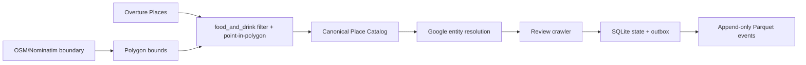
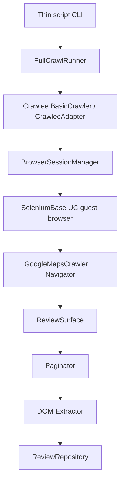

# Architecture

## Problem and sources

The project turns a geographic food-business scope into review data suitable
for downstream analytics. Overture Maps is the canonical POI discovery source.
OSM/Nominatim provides administrative boundaries. Google Maps supplies entity
resolution, enrichment, and reviews. Google broad-grid discovery is an
experiment/fallback, not the source of truth; Foursquare is deferred.

## High-level flow



The catalog is persisted and reused by smoke and benchmark workflows. They do
not rebuild taxonomy or spatial filtering from raw Overture records.

## Task and browser flow



The browser layer owns startup, warm-up, health, reuse, retirement, and
recreation. With concurrency 1, a healthy browser can be reused across places.
Crawlee owns scheduling/retry orchestration; Google-specific DOM logic stays
under `sources/google_maps`.

## Review modes

- `REVIEW_FULL` crawls the configured review surface and persists observations.
- `REVIEW_INCREMENTAL` processes newest reviews and stops after a configurable
  streak of known unchanged IDs, subject to safety limits. Stable review ID is
  the identity key; content hash detects mutable changes.
- `REVIEW_RECONCILIATION` revisits a recent review window to find missed new
  reviews, edits, and possible deletions. It never hard-deletes rows.

Reconciliation uses a coverage gate: `NOT OBSERVED != MISSING`. Missing/deletion
evaluation is blocked unless the expected window is fully observed or a strong,
explicit end-of-list signal is verified. Pagination no-growth alone is not
enough. Incomplete runs leave miss counters untouched and report suppressed
evaluation.

## Access policy

Review access is classified as `FULL`, `LIMITED`, or `UNKNOWN` before extraction.
`FULL` proceeds normally. `LIMITED` is deferred with exponential backoff and
jitter. `UNKNOWN` receives a bounded fresh-session retry before deferral.
Browser/runtime failures are tracked separately from access failures.

## Persistence

```text
Review
  -> ReviewRepository
  -> SQLite durable state
  -> pending_review_events (same transaction)
  -> ParquetReviewWriter
  -> append-only INSERT / UPDATE events
```

SQLite at `data/state/crawler_state.sqlite3` owns review identity, content
hash, first/last-seen metadata, reconciliation counters, checkpoint metadata,
and pending outbox state. The primary key is `(source, source_review_id)`.

Parquet at `data/lake/google_maps_reviews/` owns normalized review payloads and
change events for downstream DuckDB, Spark, GCS, or BigQuery use. Unchanged
reviews update SQLite last-seen metadata without emitting a Parquet row.

## Technology choices

- Python keeps browser orchestration and data contracts accessible and testable.
- Crawlee BasicCrawler provides bounded scheduling, retries, and checkpoints.
- SeleniumBase UC provides the guest browser session used by the current DOM
  path.
- SQLite is a durable local transactional state/outbox store with no service
  dependency for the MVP.
- Parquet is columnar, append-friendly, and directly consumable by analytics
  engines. DuckDB can inspect it with `read_parquet(..., union_by_name=true)`.

## Observability and testing

Each run retains progress logs, checkpoints, run metadata, per-store metadata,
scroll metrics, review-ID traces, DLQ records, summary metrics, and persistence
paths. Tests cover crawler lifecycle, access policy, state idempotency, outbox
replay, incremental/reconciliation behavior, and bounded persistence flows.

## Limitations and next step

Google-only businesses missing from Overture are an accepted MVP limitation.
Relative review labels are preserved as raw values; exact publication times are
not invented. Network review extraction is experimental and is not the
production default. The current deployment is intentionally conservative around
browser concurrency and access throttling.

The next scaling step is a PostgreSQL-backed work queue and state store with
multiple isolated browser workers, while keeping one active place per browser
worker and preserving the same idempotent review contract.
